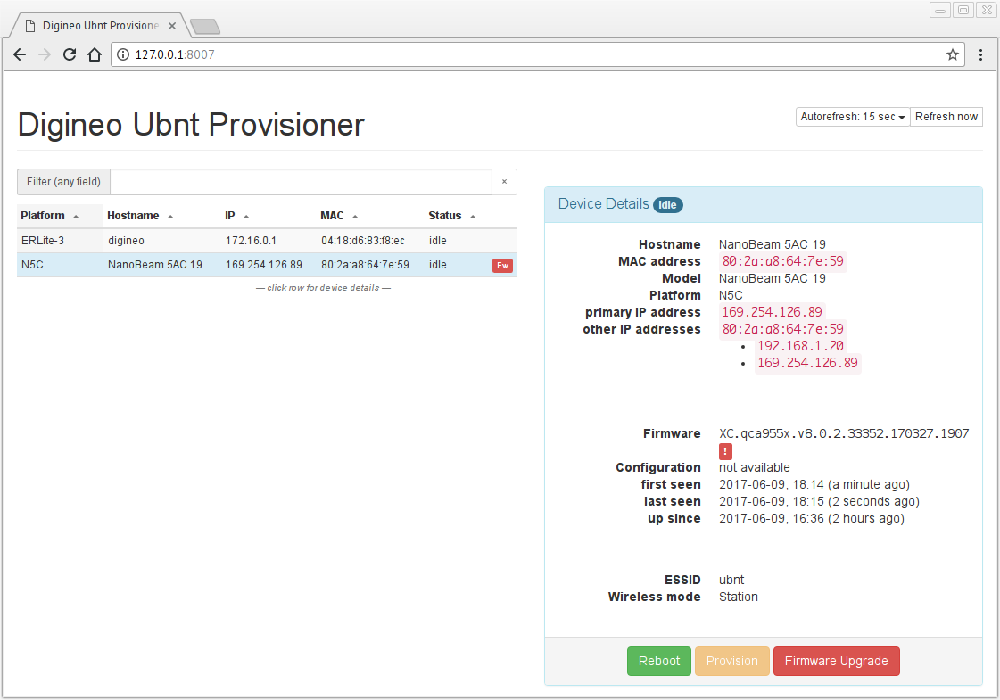

# ubnt-tools

This is a collection of tools we've build to help us automate large
deployments of Ubiquiti wireless devices.

Currently, this repository contains the source code for the following:

- [Ubiquiti Device Discovery](#ubiquiti-device-discovery)
- [AirMax provisioning](#airmax-provisioning)

## Installation

In the near future, you'll find downloads for the major platforms in
the GitHub release section.

For now, you'll need to follow the build instructions below.

## Building

### Prerequisites

You need to have the following packages installed:

- Go >= 1.8,  <https://golang.org/dl/>
- GNU Make,  <https://www.gnu.org/software/make/>
- Git,  <https://git-scm.com/downloads>

If you want to build the provisioning tool, you'll need additionally:

- NodeJS >= 7 and NPM >= 3, <https://nodejs.org/en/download/current/>
- yarn, <https://yarnpkg.com/en/docs/install>

### Getting the sources

Clone this repository (assuming your `GOPATH` is setup properly):

    $ mkdir -p $GOPATH/src/github.com/digineo
    $ cd $GOPATH/src/github.com/digineo
    $ git clone https://github.com/digineo/ubnt-tools

### Building the binaries

Run `make`:

    $ cd $GOPATH/src/github.com/digineo/ubnt-tools
    $ git pull    # optionally
    $ make

By default, this will build both the discovery and the provisioning tool.
If you only need one of them, instead of `make` run one of the following
suitable commands:

    $ make discovery
    $ make provisioner

Note: Building the provisioner the for first time will try to download a
bunch of NPM packages (the corresponding `node_modules` directory is, at
the time of writing, around 100MB in size).

## Ubiquiti Device Discovery

This is a standalone binary to detect Ubiquiti AirMax devices in your
local network. It is basically a re-implementation of the Java tool
[provided by Ubiquiti](https://www.ubnt.com/download/utilities/default/default/device-discovery-tool-java-all-platforms)
in Go as a terminal application (i.e. it can easily be deployed on remote
systems).

### Usage

Simply invoke the discovery tool with an interface name:

    $ ubnt-discovery eth0

This will broadcast the discovery packages (with exponential back-off),
and report back the newly discovered devices:

    2017/06/08 17:39:02 [discovery] listen on 172.16.1.7:49317
    2017/06/08 17:39:02 [discovery] listen on 169.254.0.7:51705
    2017/06/08 17:39:02 [discovery] sent broadcast, will send again in 4s
    2017/06/08 17:39:02 [discovery] found new device:
    Device
      MAC:          80:2a:a8:64:7e:59
      Model:        NanoBeam 5AC 19
      Platform:     N5C
      Firmware:     XC.qca955x.v8.0.2.33352.170327.1907
      Hostname:     NanoBeam 5AC 19
      Booted at:    2017-06-08T16:08:50+02:00
      booted:       1h30m12.00001943s ago
      first seen:   24.031µs ago
      last seen:    24.031µs ago
      IP addresses on interface 80:2a:a8:64:7e:59
        - 192.168.1.20
        - 169.254.126.89
      ESSID:        ubnt
      WMode:        Station
    2017/06/08 17:39:02 [discovery] found new device:
    Device
      MAC:          04:18:d6:83:f8:ec
      Model:
      Platform:     ERLite-3
      Firmware:     EdgeRouter.ER-e100.v1.9.1.4939093.161214.0705
      Hostname:     digineo
      Booted at:    2017-04-10T10:36:11+02:00
      booted:       1423h2m51.000008187s ago
      first seen:   11.759µs ago
      last seen:    11.759µs ago
      IP addresses on interface 04:18:d6:83:f8:ec
        - 172.16.0.1
        - 172.16.2.1

## AirMax provisioning

This provisioning tool helps managing a fleet of NanoBeam devices (it
might work for other AirMax devices, but we haven't had the chance/need
to try it with other devices).

Given a directory with device configuration files, it can reconfigure
("provision") devices.

If you also have a local copy of device firmwares, you can upgrade the
devices with a single click.

### Usage

First, create a config file. To get an example config file, run

    $ ubnt-provisioner -h

and save the example to `config.yml` (the name can be arbitrary).
Modify the content to your needs.

Then start the provisioner:

    $ ubnt-provisioner -c /path/to/config.yml
    ,____  __       __
    |    \|__|-----|__|-----.-----,-----.
    |  -  |  |  _  |  |     |  .__|  _  |
    |____/|__|___  |__|__|__|_____|_____|
             |_____|  Digineo Ubnt provisioner
                      Version 539be0b-dev (2017-06-09 12:57:02)
                      Build   7 (2017-06-09 17:14:18)
    2017/06/09 18:12:25 [discovery] listen on 172.16.1.7:33580
    2017/06/09 18:12:25 [discovery] listen on 169.254.0.7:41207
    2017/06/09 18:12:25 [discovery] sent broadcast, will send again in 4s
    2017/06/09 18:12:25 [webui] Starting Web UI on http://127.0.0.1:8007
    2017/06/09 18:12:25 [main] (re-) discovered NanoBeam 5AC 19 (80:2a:a8:64:7e:59)
    2017/06/09 18:12:25 [main] (re-) discovered digineo (04:18:d6:83:f8:ec)
    2017/06/09 18:12:29 [discovery] sent broadcast, will send again in 4.08s

Finally, point your web browser with address given (in this case
<http://127.0.0.1:8007>):

